# Report

# Indice
1. Introzione
2. Modello di dominio
3. Requisiti specifici\
     3.1 Requisiti funzionali
     3.2 Requisiti non funzionali
4. System design
5. OO design\
     5.1 Diagrammi di sequenza
     5.2 Diagrammi delle classi
6. Riepilogo dei casi di test
7. Manuale utente
8. Processo di sviuluppo ed organizzazione del lavoro
9. Analisi retrospettiva

# 1. Introduzione
Wordle è un videogioco ideato da un programmatore, Josh Wardle, nel 2021. Wordle, Diventato virale su Twitter è stato poi acquistato dal New York Times. 

L’obiettivo del gioco è indovinare una parola segreta, sprovvisti di indizi iniziali sulla stessa, attraverso dei tentativi, per ognuno dei quali:  

- Se le lettere sono presenti nella parola segreta ed inoltre sono nella posizione giusta lo sfondo delle lettere si colorerà di verde; 

- Se le lettere sono presenti nella parola segreta, ma nella posizione sbagliata lo sfondo delle lettere si colorerà di giallo; 

- Altresì rimarranno a sfondo grigio. 

# 2. Modello di dominio
Il seguente modello di dominio, indipendente dal software, è la base di partenza del design della "business logic" del progetto wordle.
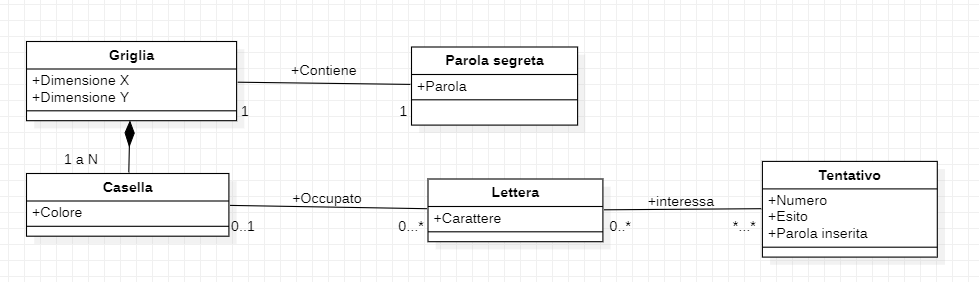

# 3. Requisiti specifici
*  # 3.1 Requisiti funzionali:
    **-Codice caso d'uso:** UC01;\
    **-Nome:** Mostrare la parola segreta;\
    **-Attori:** Paroliere;\
    **-Obiettivo:** Visualizzare la parola segreta attuale;\
    **-Pre-Condizioni:** La partita non deve essere in corso;\
    **-Post-Condizioni:** Viene stampata a schermo la parola segreta;\
    **-User-Story:** Come Paroliere, voglio visualizzare la parola segreta;

    **-Codice caso d'uso:** UC02;\
    **-Nome:** Scegliere una parola casuale da usare nella prossima sessione di gioco;\
    **-Attori:** Paroliere;\
    **-Obiettivo:** Qualora il paroliere non scelga una parola segreta, questa deve essere decisa casualmente;\
    **-Pre-Condizioni:** La partita non deve essere in corso;\
    **-Post-Condizioni:** Impostata una nuova parola segreta in modo casuale ;\
    **-User-Story:** Come Paroliere, voglio che la parola segreta sia selezionata casualmente, qualora non sia stata scelta una parola segreta;

    **-Codice caso d'uso:** UC03;\
    **-Nome:** Impostare manualmente la parola segreta;\
    **-Attori:** Paroliere;\
    **-Obiettivo:** Cambio della parola segreta;\
    **-Pre-Condizioni:** La parola non deve contenere simboli speciali, numeri ed il numero di caratteri deve rispettare il numero caratteri del gioco. La partita non deve essere in corso;\
    **-Post-Condizioni:** La parola scelta verrà usata come parola segreta nella prossima partita;\
    **-User-Story:** Come paroliere, voglio poter scegliere con quale parole giocare nella prossima partita;

    **-Codice caso d'uso:** UC04;\
    **-Nome:** Visionare la lista dei comandi di gioco;\
    **-Attori:** Giocatore o Paroliere;\
    **-Obiettivo:** Descrizione concisa dei comandi a schermo;\
    **-Pre-Condizioni:** Nessuna pre-condizione;\
    **-Post-Condizioni:** Presente a schermo descrizione concisa dei comandi di gioco;\
    **-User-Story:** Come paroliere/giocatore voglio visualizzare la lista dei comandi;

    **-Codice caso d'uso:** UC05;\
    **-Nome:** Avviare partita;\
    **-Attori:** Giocatore;\
    **-Obiettivo:** Iniziare nuova partita;\
    **-Pre-Condizioni:** La parola deve essere impostata e la partita non deve essere attualmente già in corso;\
    **-Post-Condizioni:** Avviare l'interfaccia della partita;\
    **-User-Story:** Come giocatore voglio avviare una nuova partita;

    **-Codice caso d'uso:** UC06;\
    **-Nome:** Abbandono della partita;\
    **-Attori:** Giocatore;\
    **-Obiettivo:** Chiusura della partita;\
    **-Pre-Condizioni:** La partita deve essere in corso;\
    **-Post-Condizioni:** Se la conferma è positiva si comunica l'abbandono, se la conferma è negativa si predispone l'app a ricevere un altro tentativo o comandi;\
    **-User-Story:** Come goicatore voglio abbandonare la partita;\

    **-Codice caso d'uso:** UC07;\
    **-Nome:** Uscire dal gioco;\
    **-Attori:** Giocatore o Paroliere;\
    **-Obiettivo:** Il gioco deve chiudersi;\
    **-Pre-Condizioni:** Il gioco deve essere avviato;\
    **-Post-Condizioni:** Se la conferma è positiva, il gioco si chiude;\
    **-User-Story:** Come paroliere/giocatore voglio chiudere il gioco;

    **-Codice caso d'uso:** UC08;\
    **-Nome:** Tentativo;\
    **-Attori:** Giocatore;\
    **-Obiettivo:** Inserire una parola e visualizzare se essa corrisponde alla parola segreta o se vi sono match parziali;\
    **-Pre-Condizioni:** La partita deve essere in corso, inoltre la parola inserita deve essere composta da sole lettere e deve rispecchiare la lunghezza della parola segreta del gioco;\
    **-Post-Condizioni:** Le lettere della parola inserita saranno: di colore verde se sono presenti nella parola segreta e nella giusta posizione, di colore giallo se sono presenti nella parola segreta ma nella posizione sbagliata ed infine grigio se le lettere non sono presenti nella parola segreta;\
    **-User-Story:** Come giocatore voglio poter effettuare un tentativo;  

    

    

    
*  # 3.2 Requisiti non funzionali: 
* Vengono applicati i principi dell'Objected Oriented Design per garantire **manuntenibilità ed efficienza** del software.
* Creati casi di test automatici grazie alla Junit
* Si garantisce la **portabilità** del software grazie all'utilizzo di Docker (inserita guida all'utilizzo nella sezione "manuale utente")
* Terminali compatibili con l'applicazione wordle:
     *Window:
          * Powershell
          * Terminal (sottosistema Linux per Windows)
          * Git bash 
     * Linux: 
          * Terminal
     * MacOs:
          * Terminal

# System design
 **Diagramma dei package**
 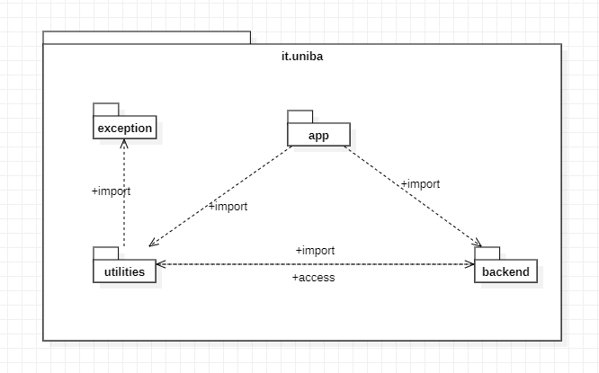

# 5. OO Design
*  # 5.1 Diagrammi di sequenza
     **UserStory:** Impostare manualmente la parola segreta

     **User Story:** Effettuare un tentativo
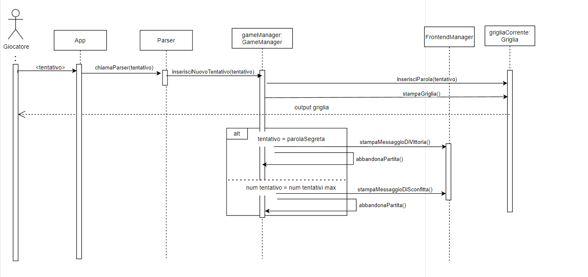
     **User Story:** Iniziare una nuova partita
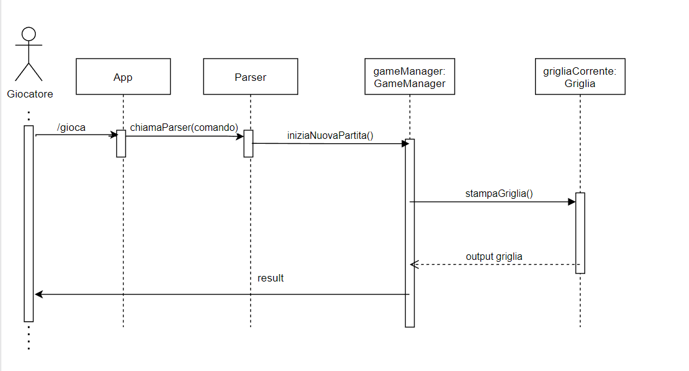
     **User Story:** Abbandonare la partita
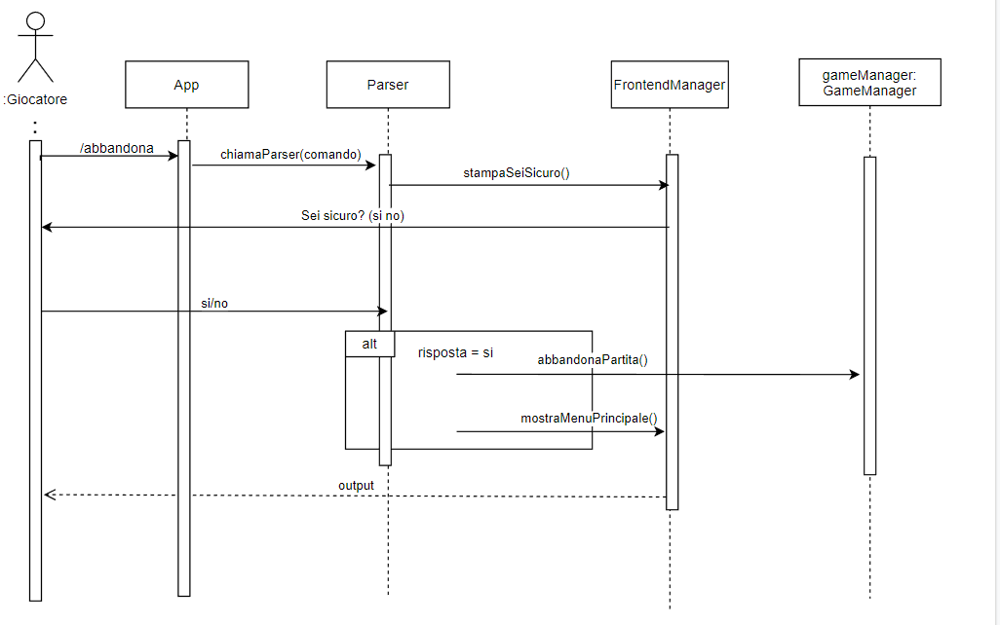
     **User Story** Mostrare la parola segreta
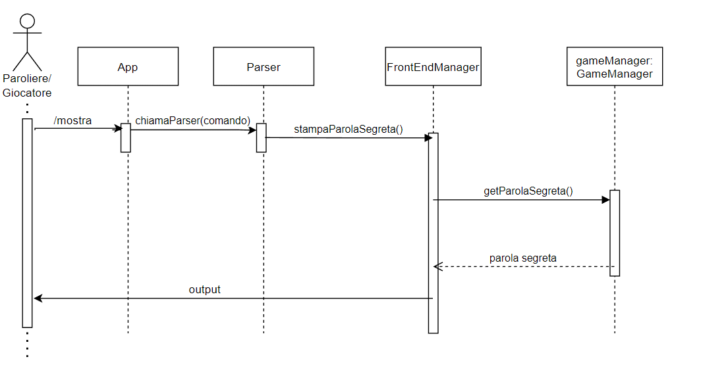

*   # 5.2 Diagrammi delle classi
     **User Story:** Permettere di effettuare un tentativo
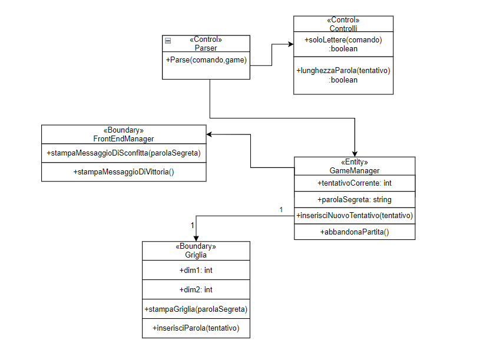
     **User Stories:** Impostare una parola segreta, iniziare una nuova partita, abbandonare una partita, terminare il gioco 
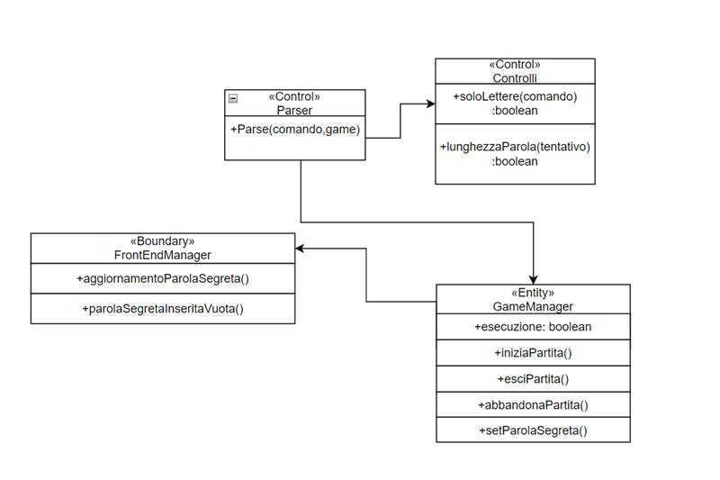
     **User Stories:** Mostrare aiuto
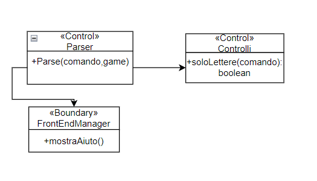

# 6. Riepilogo dei test
Tabella riassuntiva della copertura dei test da CoverAll: 
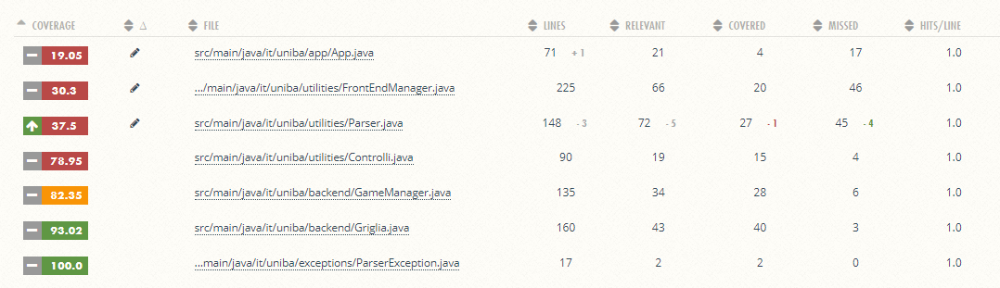
# 7. Manuale utente

* **Download ed avvio del gioco - Guida Docker** 
     - Pre-requisito: aver installato ed avviato **Docker**.
     - Download dell'immagine del gioco attraverso: \
          docker pull ghcr.io/softeng2122-inf-uniba/wordle-lamport:latest \
     - Avvio del gioco attraverso il comando:\
          docker run --rm -it ghcr.io/softeng2122-inf-uniba/wordle-lamport:latest

* **Comandi gioco Wordle** 
     - nuova < parola > : permette di impostare una nuova parola segreta
     - mostra : permette di visionare la parola segreta attuale
     - help, --help e -h : mostra a schermo la lista dei comandi di gioco
     - gioca : avvio di una partita 
     - abbandona : chiusura di una partita
     - esci : chiusura dell'applicazione
     - < parola > : digitando una parola e premendo invio si effettua un tentativo

* **Come giocare?**
     1. Impostare parola segreta attraverso il comando nuova < parola >
     2. Usare il comando gioca per avviare la partita
     3. Scrivere una parola per effettuare un tentativo
     4. Enjoy!

# 8 Processo di  sviluppo e organizzazione del lavoro

All'inizio di ogni sprint ci siamo confrontati in meeting, mantenendo a vista lo sprint backlog, dal quale abbiamo tratto le issues. \
ogni componente del team ha lavorato principalmente su determinate zone del software, quando dividevamo le issues, se possibile cercavamo di dividerle in base a chi avesse più conoscenza delle porzioni di progetto che la riguardassero.
In caso di necessità si è sfruttata anche la tecnica di sviluppo agile **pair programming** per aiutare un collega in difficoltà o con dubbi.\
Abbiamo gestito il lavoro tramite le cards nella project board offerta da github, assegnandoci il lavoro e concordando uno o più reviewer per ogni issue, il quale ha il compito di controllare che il lavoro svolto non presenti problemi sfuggiti a chi lo ha realizzato.
Si è inoltre seguito il **github flow**, lavorando su branch dedicati per le issue, ed effettuando pull request al termine del lavoro, le quali venivano accettate dal reviewer dopo aver controllato il lavoro.
Al completamento delle issues si è effettuata una call per testare l'applicazione da Docker, cercando problemi e bug, per poterli fixare.\
In fine al termine di ogni sprint, ci siamo confrontati per capire cosa fosse andato e cosa no, mantenendo il rispetto tra colleghi nel team, ma con estrema sincerità necessaria per migliorare il nostro lavoro di gruppo e coesione, la quale ha permesso di uniformaci come squadra verso il nostro obiettivo comune.

# 9. Analisi retrospettiva
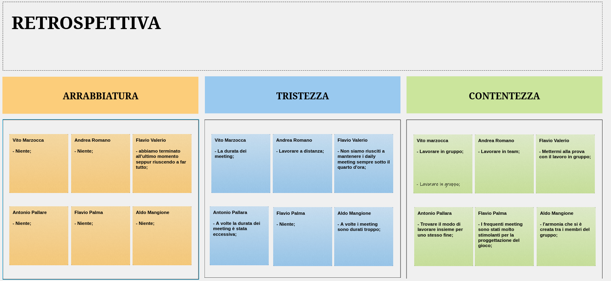

